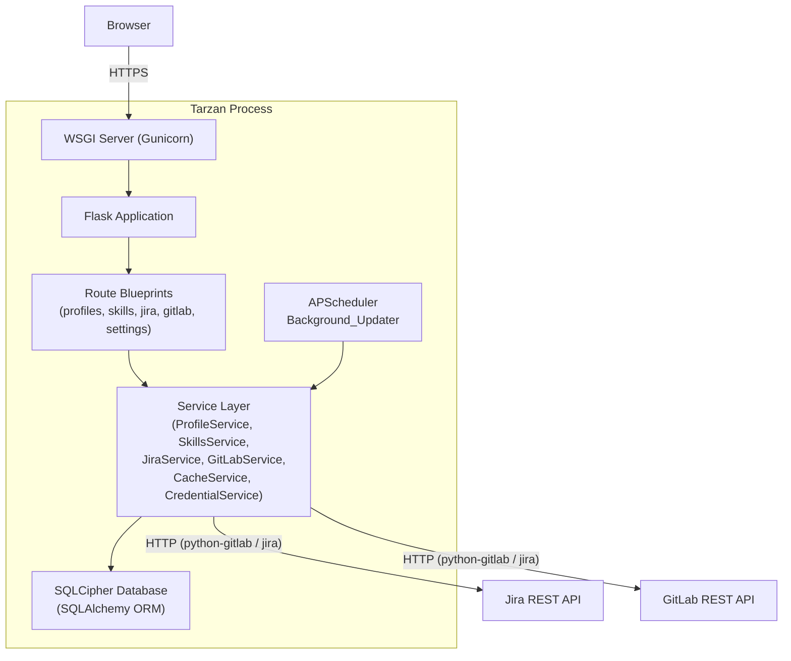
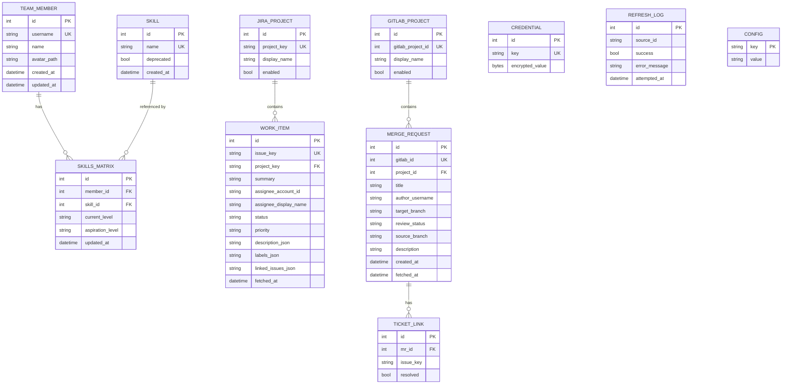

# Design Document: Team Dashboard (Tarzan)

## Overview

Tarzan is a server-rendered web application that aggregates data from Jira and GitLab APIs to give engineering managers a unified view of their team. It is written in Python using the Flask micro-framework and Jinja2 templates. Data is stored in a local SQLCipher-encrypted SQLite database that doubles as the persistent cache. A background scheduler (APScheduler) refreshes external API data on a configurable interval without blocking page requests.

The guiding design principles are:

- **Security-first**: AES-256 encryption at rest via SQLCipher, HTTPS enforcement, server-side session management, and strict input validation throughout.
- **Speed from cache**: all dashboard pages are served entirely from the local database; no synchronous external API call is made during a page request.
- **Extensibility**: Flask Blueprints plus a thin service layer mean adding a new dashboard page requires changes in at most 3 files (a Blueprint/route file, a service file, and a template).
- **Minimal dependencies**: prefer the standard library and well-maintained, actively used packages; avoid introducing heavy frameworks.

### Technology Stack

| Concern | Choice | Rationale |
|---|---|---|
| Web framework | Flask 3.x | Lightweight, template-native, Blueprint support satisfies extensibility requirement; synchronous WSGI is sufficient for a low-concurrency internal tool |
| Templating | Jinja2 (bundled with Flask) | Template inheritance + `` partials cover the component-reuse requirement without an extra library |
| Database / cache | SQLite via SQLCipher (pysqlcipher3) | File-based, zero-server, 256-bit AES encryption at rest satisfies Req 10.1 and 10.6 |
| ORM | SQLAlchemy 2.x | Parameterised queries prevent SQL injection; schema migrations via Alembic |
| Background scheduler | APScheduler 3.x (BackgroundScheduler) | In-process interval jobs; integrates cleanly with Flask app context |
| API clients | `python-gitlab` and `jira` (PyPI) | Official/well-maintained wrappers; abstract HTTP transport details |
| Session management | Flask-Login + itsdangerous signed cookies | Server-side session invalidation, CSRF protection |
| Logging | Python `logging` + `python-json-logger` | Structured JSON on stdout; no secrets emitted |
| Containerisation | Docker Compose + Kubernetes manifests | Satisfies Req 12.1 and 12.2 |

---

## Architecture

### High-Level Component Diagram



### Request Lifecycle

1. Browser sends an HTTPS request.
2. Flask's before-request hook enforces HTTPS (redirect plain HTTP in non-localhost contexts) and checks session validity.
3. The matching Blueprint route handler calls one or more Service methods.
4. Service methods read from the SQLCipher database (never call external APIs synchronously).
5. The route handler passes the result to a Jinja2 template and returns the rendered HTML.
6. In parallel, APScheduler fires `refresh_all()` on its configured interval, which calls Service methods that query external APIs and write back to the database.

### Extensibility Contract

Adding a new dashboard page requires changes in exactly these 3 locations:

1. `app/blueprints/<name>.py` — route definition + service call.
2. `app/services/<name>_service.py` — data-access logic.
3. `app/templates/<name>/index.html` — Jinja2 template extending `base.html`.

The navigation partial (`app/templates/partials/_nav.html`) and base layout are shared; no other files need to change.

---

## Components and Interfaces

### 1. Flask Application Factory (`app/__init__.py`)

Initialises Flask, registers Blueprints, attaches SQLAlchemy, Flask-Login, and starts APScheduler inside a `with app.app_context()` block. Uses the application-factory pattern so the app can be instantiated with different configs (test, production).

```
create_app(config: Config) -> Flask
```

### 2. Route Blueprints (`app/blueprints/`)

Each Blueprint owns a URL prefix and a small set of route functions. Route functions validate path/query parameters, call Service methods, and render templates. They contain no business logic.

| Blueprint | Prefix | Responsibilities |
|---|---|---|
| `auth_bp` | `/auth` | Login, logout, session management |
| `profiles_bp` | `/profiles` | Team member profile CRUD |
| `skills_bp` | `/skills` | Skill catalogue management, skills dashboard |
| `jira_bp` | `/jira` | Work items dashboard, detail view, reassignment |
| `gitlab_bp` | `/gitlab` | Merge requests dashboard |
| `settings_bp` | `/settings` | Configuration: API credentials, thresholds, intervals |

### 3. Service Layer (`app/services/`)

Services are plain Python classes injected with a SQLAlchemy session. They expose typed methods and are the only layer that touches the database or external API clients. They never return SQLAlchemy model objects to the Blueprint layer — they return plain dataclasses or dicts so templates remain decoupled from the ORM.

```python
class ProfileService:
    def list_profiles() -> list[ProfileDTO]
    def get_profile(username: str) -> ProfileDTO | None
    def create_profile(data: CreateProfileInput) -> ProfileDTO
    def update_profile(username: str, data: UpdateProfileInput) -> ProfileDTO
    def save_avatar(username: str, file_bytes: bytes, mime_type: str) -> str  # returns path
```

```python
class SkillsService:
    def list_catalogue() -> list[SkillDTO]
    def add_skill(name: str) -> SkillDTO
    def remove_skill(skill_id: int) -> RemovalResult  # includes reference count
    def assign_skill(username: str, skill_id: int, current: Level, aspiration: Level | None) -> None
    def get_team_skills_summary() -> list[SkillSummaryDTO]
    def import_matrix_csv(csv_text: str, create_missing_skills: bool = False) -> SkillsImportResult
```

`import_matrix_csv` implements the bulk skills import (Requirement 13). It parses CSV text with a header row (`username`, `skill`, `current_level`, optional `aspiration_level`; header case and column order insensitive), validates every row, and applies the import atomically: if any row is invalid, no rows are imported and the returned `SkillsImportResult` carries one `ImportRowError` (row number, field, reason — never the invalid value) per failing row. Valid imports upsert matrix entries exactly as `assign_skill` would, in a single commit. When `create_missing_skills` is true, skills referenced by the CSV but absent from the catalogue (case-insensitive) are added to the catalogue as part of the same atomic import.

```python
class JiraService:
    def list_work_items(assignee: str | None = None) -> list[WorkItemDTO]
    def get_work_item(issue_key: str) -> WorkItemDetailDTO | None
    def reassign_work_item(issue_key: str, assignee_account_id: str) -> ReassignResult
    def fetch_and_cache(project_key: str) -> FetchResult  # called by scheduler
```

```python
class GitLabService:
    def list_merge_requests(author_or_reviewer: str | None = None) -> list[MergeRequestDTO]
    def fetch_and_cache(project_id: int) -> FetchResult  # called by scheduler
```

```python
class CacheService:
    def get_last_refresh(source_id: str) -> datetime | None
    def record_refresh(source_id: str, success: bool, error: str | None) -> None
    def consecutive_failure_count(source_id: str) -> int
```

```python
class CredentialService:
    def get_credential(key: str) -> str | None    # decrypts on read
    def set_credential(key: str, value: str) -> None  # encrypts on write
```

### 4. API Clients (`app/clients/`)

Thin wrappers around `python-gitlab` and `jira` that handle authentication, pagination, and timeout enforcement. They raise typed exceptions (`JiraClientError`, `GitLabClientError`) rather than leaking library-specific exceptions to the service layer.

```python
class JiraClient:
    def __init__(server: str, token: str, timeout_seconds: int = 10)
    def search_issues(jql: str) -> list[dict]
    def get_issue(issue_key: str) -> dict
    def update_assignee(issue_key: str, account_id: str) -> None

class GitLabClient:
    def __init__(url: str, token: str, timeout_seconds: int = 10)
    def list_merge_requests(project_id: int, state: str = "opened") -> list[dict]
```

### 5. Background Updater (`app/scheduler.py`)

An `APScheduler BackgroundScheduler` that is configured at startup. The interval is read from the database config (1–60 minutes, default 15). On each tick it calls `JiraService.fetch_and_cache()` and `GitLabService.fetch_and_cache()` for every configured project. Errors are caught and recorded via `CacheService.record_refresh()`.

```python
def start_scheduler(app: Flask) -> BackgroundScheduler
def refresh_all(app: Flask) -> None
```

### 6. Encryption Layer (`app/crypto.py`)

All sensitive fields (API tokens, profile details, skills matrix entries) are stored in the SQLCipher-encrypted database file. The database key is derived from an environment variable (`TARZAN_DB_KEY`) using PBKDF2-HMAC-SHA256 with a fixed application salt so it is reproducible across restarts without being stored anywhere.

The `CredentialService` additionally wraps individual credential values with Fernet (AES-128-CBC + HMAC-SHA256) for a second layer of field-level encryption before writing to the `credentials` table. The Fernet key is itself stored encrypted in the database using the database master key.

### 7. Templating System (`app/templates/`)

```
templates/
  base.html                  ← full-page skeleton (header, nav, main, footer)
  partials/
    _nav.html                ← navigation bar partial
    _work_item_card.html     ← reusable work item card
    _mr_card.html            ← reusable merge request card
    _skill_badge.html        ← proficiency badge
    _flash_messages.html     ← alert/error display
    _staleness_warning.html  ← data staleness banner
  profiles/
    index.html
    detail.html
    edit.html
  skills/
    catalogue.html
    dashboard.html
    import.html
  jira/
    index.html
    detail.html
  gitlab/
    index.html
  settings/
    index.html
  auth/
    login.html
```

All templates extend `base.html` via ``. Reusable fragments use ``.

---

## Data Models

All tables reside in a single SQLCipher database file (e.g. `tarzan.db`). The file is opened with the `PRAGMA key` directive derived from `TARZAN_DB_KEY` before any other operation. SQLAlchemy 2.x models are defined with `DeclarativeBase`.

### Entity-Relationship Overview



### Key Design Decisions

**WORK_ITEM.description_json / labels_json / linked_issues_json**: Stored as JSON strings rather than normalised child tables because this data is fetched from Jira verbatim and only read for display. Normalising it would add complexity without benefit given the read-only, cache-only nature of these fields.

**REFRESH_LOG**: Append-only. The `CacheService.consecutive_failure_count()` method queries the last N rows for a given `source_id` ordered by `attempted_at DESC` to detect 3+ consecutive failures (Req 8.5). Rows older than 30 days are pruned on startup.

**CONFIG table**: Simple key/value store for runtime configuration (refresh interval, review threshold). Values are plain strings; the application layer parses them to the expected type and validates ranges.

**CREDENTIAL table**: `encrypted_value` is a Fernet-encrypted blob. The plaintext is never materialised outside of the Python process and is never logged.

**Proficiency levels**: Stored as the string literals `"Beginner"`, `"Intermediate"`, `"Advanced"`, `"Expert"` (Python Enum at the application layer validates on write).

### Avatar Storage

Avatar files are stored on the local filesystem at `TARZAN_DATA_DIR/avatars/<username>.<ext>`. Only the path is stored in the database. The Flask route for avatar serving validates the path is within the designated directory before streaming the file (prevents path traversal).

---

## Correctness Properties

*A property is a characteristic or behavior that should hold true across all valid executions of a system — essentially, a formal statement about what the system should do. Properties serve as the bridge between human-readable specifications and machine-verifiable correctness guarantees.*

Property-based tests for Tarzan are implemented using [Hypothesis](https://hypothesis.readthedocs.io/) (Python). Each test is configured for a minimum of 100 iterations.

---

### Property 1: Profile persistence round-trip

*For any* valid combination of name, username, and avatar path, creating a profile via `ProfileService.create_profile()` and then retrieving it via `ProfileService.get_profile(username)` must return a record whose name, username, and avatar path match the input values exactly.

Similarly, *for any* subsequent update of those fields via `ProfileService.update_profile()`, a subsequent `get_profile()` call must return the updated values.

**Validates: Requirements 1.2, 1.3**

---

### Property 2: Whitespace-only profile fields are rejected

*For any* string composed entirely of whitespace characters (space, tab, newline, etc.), submitting it as the `name` or `username` field to `ProfileService.create_profile()` or `ProfileService.update_profile()` must raise a validation error and leave the database state unchanged.

**Validates: Requirements 1.4**

---

### Property 3: Username uniqueness invariant

*For any* existing Team_Member username, attempting to create a second profile with the same username must be rejected regardless of the case or surrounding whitespace of the new submission.

**Validates: Requirements 1.6**

---

### Property 4: Avatar file validation

*For any* byte sequence and declared MIME type, `ProfileService.save_avatar()` must accept the upload iff the MIME type is one of `image/jpeg`, `image/png`, `image/gif`, `image/webp` AND the byte length is ≤ 5 242 880 (5 MiB). For any input that fails either condition, the method must raise a validation error and leave the avatar store unchanged.

**Validates: Requirements 1.7**

---

### Property 5: Skill assignment round-trip

*For any* skill in the Skill_Catalogue and any team member, assigning the skill via `SkillsService.assign_skill()` with a valid proficiency level, then reading back the Skills_Matrix entry, must return an entry whose `current_level` and `aspiration_level` match the input values exactly.

**Validates: Requirements 2.2, 2.3**

---

### Property 6: Invalid proficiency level is rejected

*For any* string not in the set `{"Beginner", "Intermediate", "Advanced", "Expert"}`, submitting it as the `current_level` argument to `SkillsService.assign_skill()` must raise a validation error, and the existing Skills_Matrix entry (if any) must remain unchanged.

**Validates: Requirements 2.5**

---

### Property 7: Deprecated skill references are preserved

*For any* skill that has one or more Skills_Matrix references, calling `SkillsService.remove_skill()` must leave all pre-existing Skills_Matrix entries intact and mark each entry's `skill_deprecated` flag as `True`. No matrix entry may be silently deleted.

**Validates: Requirements 2.4**

---

### Property 8: Skill name case-insensitive uniqueness

*For any* skill name already present in the Skill_Catalogue, attempting to add a skill whose name is a case-insensitive match (e.g. `"python"` vs `"Python"` vs `"PYTHON"`) must be rejected.

**Validates: Requirements 2.7**

---

### Property 9: Skills summary aggregation correctness

*For any* set of Skills_Matrix entries in the database, `SkillsService.get_team_skills_summary()` must return a summary where:
- Every skill in the Skill_Catalogue appears in the result.
- For each skill, the count at each of the four proficiency levels equals the number of Skills_Matrix entries with that skill and level (never omitted, zero counts included).
- The aspiration count for each skill equals the number of entries where `aspiration_level` is strictly higher than `current_level` in the ordering Beginner < Intermediate < Advanced < Expert.

**Validates: Requirements 3.1, 3.2, 3.3**

---

### Property 10: Skills summary reflects latest matrix state

*For any* Skills_Matrix update applied via `SkillsService.assign_skill()`, a subsequent call to `SkillsService.get_team_skills_summary()` within the same database transaction context must reflect the updated counts.

**Validates: Requirements 3.4**

---

### Property 11: Fetch-and-cache round-trip

*For any* list of Work_Items returned by a mocked `JiraClient.search_issues()` call, invoking `JiraService.fetch_and_cache(project_key)` must result in each returned item being retrievable via `JiraService.list_work_items()` with all fields (issue key, summary, assignee, status, priority) intact.

The same property holds for GitLab: *for any* list of Merge_Requests returned by a mocked `GitLabClient.list_merge_requests()` call, invoking `GitLabService.fetch_and_cache(project_id)` must result in each item being retrievable via `GitLabService.list_merge_requests()` with all required fields intact.

**Validates: Requirements 4.1, 6.1, 8.3**

---

### Property 12: Cache retention on fetch failure

*For any* pre-existing cache state (non-empty set of Work_Items or Merge_Requests) and any simulated client exception from a mocked API call, invoking the corresponding `fetch_and_cache()` method must leave the cache contents unchanged — no existing item may be removed or modified.

**Validates: Requirements 4.2, 6.2, 8.4, 9.3**

---

### Property 13: Work item rendering contains required fields

*For any* WorkItemDTO with non-null issue_key, summary, assignee, status, and priority, the Jinja2 template rendering of the work item card must produce HTML that contains all five field values as visible text.

**Validates: Requirements 4.3**

---

### Property 14: Blocked and In-Review indicators are distinct and correct

*For any* WorkItemDTO with status `"Blocked"` or a non-empty blocking link list, the rendered work item card must contain the blocked indicator CSS class/marker AND must not contain the in-review indicator CSS class/marker.

*For any* WorkItemDTO with status `"In Review"` (or a configured in-review status mapping), the rendered card must contain the in-review indicator AND must not contain the blocked indicator.

*For any* WorkItemDTO with neither condition, neither indicator must appear.

**Validates: Requirements 4.4, 4.5**

---

### Property 15: Assignee filter returns only matching items

*For any* list of Work_Items in the cache and any non-null assignee filter value, `JiraService.list_work_items(assignee=filter_value)` must return a list where every item's `assignee_account_id` or `assignee_display_name` matches the filter, and no item that matches the filter is omitted.

The same property holds for Merge_Request author/reviewer filtering in `GitLabService.list_merge_requests()`.

**Validates: Requirements 4.6, 6.5**

---

### Property 16: Work item detail rendering contains all detail fields

*For any* WorkItemDetailDTO with non-null description, comments list, labels list, and linked issues list, the rendered detail view must contain all four detail sections as visible HTML content.

**Validates: Requirements 4.7**

---

### Property 17: Cache update after successful reassignment

*For any* Work_Item in the cache and any valid new assignee account ID, when `JiraService.reassign_work_item()` receives a mocked success response, the subsequent `get_work_item()` call must return the item with the `assignee_account_id` updated to the new value. No other fields may be modified.

**Validates: Requirements 5.2**

---

### Property 18: Cache unchanged after failed or timed-out reassignment

*For any* Work_Item in the cache, when `JiraService.reassign_work_item()` receives a mocked error response or a mocked timeout exception, the subsequent `get_work_item()` call must return the item with all fields unchanged.

**Validates: Requirements 5.3, 5.4**

---

### Property 19: Reassignment candidate list is a subset of configured team members

*For any* rendered reassignment UI (given a team configuration with N members), the list of selectable assignees must contain exactly the configured team members and no others.

**Validates: Requirements 5.6**

---

### Property 20: Merge request rendering contains required fields

*For any* MergeRequestDTO with non-null title, author, target_branch, created_at, and review_status, the rendered merge request card must produce HTML containing all five field values as visible text, and the review status must be one of `"Awaiting Review"`, `"Changes Requested"`, or `"Approved"`.

**Validates: Requirements 6.3**

---

### Property 21: Review threshold indicator appears iff age exceeds threshold

*For any* MergeRequestDTO and any configured Review_Threshold (1–30 days), the review threshold indicator (coloured border/badge) must appear in the rendered card iff `(now - mr.created_at).days > threshold`. For any MR age ≤ threshold, the indicator must be absent.

**Validates: Requirements 6.4**

---

### Property 22: Review threshold validation

*For any* integer value submitted as the Review_Threshold configuration: values in [1, 30] must be accepted and persisted; values outside that range must be rejected with a validation error.

The same invariant applies to the Background_Updater interval: values in [1, 60] minutes must be accepted; values outside that range must be rejected.

**Validates: Requirements 6.6, 8.1**

---

### Property 23: Ticket reference extraction correctness

*For any* string (MR title, description, or branch name), `extract_ticket_references(text)` must return exactly the set of substrings matching the pattern `[A-Z]+-[0-9]{1,6}` where the uppercase letter prefix matches a configured Jira project key. Substrings that do not match must not appear in the result. Strings with no match must produce an empty set without error.

**Validates: Requirements 7.1, 7.4**

---

### Property 24: Ticket reference deduplication

*For any* string containing the same Ticket_Reference appearing multiple times (e.g. `"ABC-123 fix for ABC-123"`), `extract_ticket_references(text)` must return a set (no duplicates) containing `"ABC-123"` exactly once.

**Validates: Requirements 7.3**

---

### Property 25: Ticket link rendering

*For any* MergeRequestDTO with a non-empty set of resolved Ticket_References, the rendered MR card must contain one `<a>` element per distinct reference, each pointing to the configured Jira instance URL for that issue key.

**Validates: Requirements 7.2, 7.3**

---

### Property 26: Consecutive failure count triggers staleness warning

*For any* `source_id` and any integer N ≥ 3, if the REFRESH_LOG table contains N consecutive failure rows for that source (no success in between), then `CacheService.consecutive_failure_count(source_id)` must return a value ≥ 3, and the dashboard render for that source must include the staleness warning banner.

*For any* sequence ending with a success row, the consecutive failure count must reset to 0 and the staleness warning must be absent.

**Validates: Requirements 8.5**

---

### Property 27: Last refresh timestamp round-trip

*For any* successful refresh event recorded via `CacheService.record_refresh(source_id, success=True)`, `CacheService.get_last_refresh(source_id)` must return a datetime within 1 second of the recorded time. The timestamp must appear in the rendered dashboard accurate to the nearest minute.

**Validates: Requirements 8.6**

---

### Property 28: Cache persistence across restart simulation

*For any* set of data written to the cache via service methods, simulating a process restart (closing and reopening the SQLCipher database connection) must result in all written records being readable via the same service methods, with all fields intact.

**Validates: Requirements 9.1**

---

### Property 29: No synchronous external API call during page render

*For any* non-empty cache state, calling any service method used by a dashboard route handler (e.g. `list_work_items()`, `list_merge_requests()`, `get_team_skills_summary()`) must never invoke any method on `JiraClient` or `GitLabClient`. The API client mocks must record zero calls.

**Validates: Requirements 9.5**

---

### Property 30: Credential encryption round-trip

*For any* string value stored via `CredentialService.set_credential(key, value)`, the bytes written to the `CREDENTIAL` table must not contain the plaintext value (i.e. the stored bytes differ from `value.encode()`). A subsequent `CredentialService.get_credential(key)` must return the original plaintext value exactly.

The same property holds for the SQLCipher database file: for any record written to the database, the raw bytes of the `.db` file must not contain the plaintext record in unencrypted form.

**Validates: Requirements 10.1, 10.6**

---

### Property 31: No secrets in log output

*For any* application operation (profile CRUD, API fetch, credential access) that involves a secret value (API token, password, Fernet key), the structured log lines emitted must not contain the secret value as a substring. The log lines may contain redacted markers (e.g. `"[REDACTED]"`) but never the original value.

**Validates: Requirements 10.2**

---

### Property 32: HTML output escapes special characters

*For any* user-supplied string containing HTML special characters (`<`, `>`, `&`, `"`, `'`), the rendered HTML output that includes that string must contain the corresponding HTML entity escapes and must not contain the raw unescaped characters as part of content (i.e. Jinja2 autoescaping is active and effective).

**Validates: Requirements 10.3**

---

### Property 33: Session invalidation after logout

*For any* valid session token, after `auth_bp` processes a logout request for that token, using the same token in a subsequent authenticated request must result in an HTTP 401 response (the session must be invalid server-side).

**Validates: Requirements 10.5**

---

### Property 34: HTTPS enforcement in non-localhost context

*For any* plain HTTP request received by the application when `TARZAN_HTTPS_ENFORCE=true`, the response must be an HTTP 301/302 redirect to the HTTPS equivalent URL, and no request body or session data must be processed before the redirect is issued.

**Validates: Requirements 10.7**

---

### Property 35: Alt text length invariant

*For any* rendered page that contains `` elements, every `` element must have an `alt` attribute, and the length of that attribute value must be greater than 0 and no greater than 125 characters.

**Validates: Requirements 11.6**

---

### Property 36: Bulk import round-trip

*For any* set of rows pairing an existing Team_Member with a skill name and valid current/aspiration levels (each username–skill pair distinct), rendering those rows as a CSV file and importing it via `SkillsService.import_matrix_csv()` with `create_missing_skills=True` must succeed with no row errors, and each Team_Member's Skills_Matrix read back via `list_matrix()` must contain exactly the imported entries with `current_level` and `aspiration_level` matching the CSV values.

**Validates: Requirements 13.2, 13.4**

---

### Property 37: Bulk import atomicity

*For any* CSV containing at least one invalid row (unknown username, unknown skill without the create-missing option, invalid level, or duplicate username–skill pair), `SkillsService.import_matrix_csv()` must report at least one `ImportRowError`, import zero rows, and leave both the Skills_Matrix and the Skill_Catalogue exactly as they were before the call — even for the valid rows in the same file, and even when `create_missing_skills=True`.

**Validates: Requirements 13.3, 13.5, 13.6, 13.7**

---

### Property 38: Missing-skill creation is gated by the option

*For any* CSV whose rows reference existing Team_Members but skills absent from the Skill_Catalogue: importing with `create_missing_skills=False` must fail with one row error per unknown-skill row and leave the catalogue unchanged; importing the same CSV with `create_missing_skills=True` must succeed, adding each distinct missing skill to the catalogue exactly once.

**Validates: Requirements 13.4**

---

## Error Handling

### Strategy

Errors are categorised by origin and handled at the layer closest to where they arise. No raw exceptions from external libraries (jira, python-gitlab, SQLAlchemy) are allowed to propagate to templates.

| Layer | Error type | Handling |
|---|---|---|
| API clients | Network timeout, HTTP 4xx/5xx | Raise typed `JiraClientError` / `GitLabClientError` with source info; caller catches and records via `CacheService` |
| Service layer | Client errors, validation failures | Raise typed application exceptions (`ValidationError`, `NotFoundError`, `ConflictError`) |
| Blueprint routes | Application exceptions | Catch, set flash message, return rendered error state without blank page |
| Background scheduler | Any exception in `refresh_all()` | Log with `source_id` and error details; increment failure count; never crash the scheduler thread |
| Database (SQLAlchemy) | `OperationalError`, `IntegrityError` | Rolled back at service boundary; raise `StorageError` to caller |
| Credential store failure | `OperationalError` on read/write | Deny access to affected feature; log failure (no credential values); never fall back to plaintext |

### Validation Errors

All user input is validated before use. Validation errors include the field name and reason but never echo the invalid value back. Returned as HTTP 400 with a JSON body `{"error": "...", "field": "..."}` for API endpoints, or a flash message for form submissions.

### Staleness Warnings

A `_staleness_warning.html` partial is included in each dashboard template. It is shown when `CacheService.consecutive_failure_count(source_id) >= 3` for any data source used by that dashboard. The warning includes the `source_id` and the timestamp of the last successful refresh.

### No-Data State

If the cache is empty for a given data source (first startup with no prior data and API unavailable), the dashboard renders a dedicated empty-state message with a prompt to verify API configuration. A partially populated page (some data, some missing) is not shown — if critical data is missing the error state is displayed.

### HTTP Error Pages

Flask error handlers are registered for 401, 403, 404, and 500. Each returns a minimal rendered HTML page that extends `base.html` and includes the standard navigation so the user can recover without the browser back button.

---

## Testing Strategy

### Dual Testing Approach

Testing is split between unit/property tests for logic and integration/smoke tests for infrastructure wiring.

```
tests/
  unit/
    test_profile_service.py
    test_skills_service.py
    test_jira_service.py
    test_gitlab_service.py
    test_cache_service.py
    test_credential_service.py
    test_ticket_linking.py
    test_crypto.py
    test_renderers.py        ← template/rendering tests
  property/
    test_profile_properties.py
    test_skills_properties.py
    test_jira_properties.py
    test_gitlab_properties.py
    test_cache_properties.py
    test_security_properties.py
    test_ticket_properties.py
  integration/
    test_jira_client.py      ← requires real or VCR-cassette Jira
    test_gitlab_client.py    ← requires real or VCR-cassette GitLab
    test_scheduler.py
  smoke/
    test_startup.py          ← config validation, DB key, scheduler start
```

### Property-Based Tests (Hypothesis)

The testing library is [Hypothesis](https://hypothesis.readthedocs.io/) v6.x. Each property test runs a minimum of 100 examples (`settings(max_examples=100)`).

Each test is tagged with a comment referencing its design property:
```python
# Feature: team-dashboard, Property 1: Profile persistence round-trip
@given(profile=st.builds(CreateProfileInput, ...))
@settings(max_examples=100)
def test_profile_round_trip(db_session, profile):
    ...
```

The following correctness properties map directly to property tests:

| Property | Test file | Key strategy |
|---|---|---|
| 1 Profile persistence round-trip | `test_profile_properties.py` | `st.text()` for name/username |
| 2 Whitespace-only fields rejected | `test_profile_properties.py` | `st.text(alphabet=string.whitespace)` |
| 3 Username uniqueness | `test_profile_properties.py` | `st.text()` sampled twice |
| 4 Avatar file validation | `test_profile_properties.py` | `st.binary()` + `st.sampled_from(MIME_TYPES)` |
| 5 Skill assignment round-trip | `test_skills_properties.py` | `st.sampled_from(LEVELS)` |
| 6 Invalid proficiency level rejected | `test_skills_properties.py` | `st.text().filter(lambda x: x not in LEVELS)` |
| 7 Deprecated skill references preserved | `test_skills_properties.py` | `st.integers(min_value=1, max_value=20)` for reference count |
| 8 Skill name case-insensitive uniqueness | `test_skills_properties.py` | `st.text()` + `str.upper()/lower()` permutations |
| 9 Skills summary aggregation | `test_skills_properties.py` | `st.lists(st.builds(MatrixEntry))` |
| 10 Skills summary reflects latest state | `test_skills_properties.py` | Same as 9 + update step |
| 11 Fetch-and-cache round-trip | `test_jira_properties.py`, `test_gitlab_properties.py` | `st.lists(st.builds(WorkItemDTO))` with mocked clients |
| 12 Cache retention on failure | `test_jira_properties.py`, `test_gitlab_properties.py` | `st.lists(...)` + mocked exception |
| 13 Work item rendering fields | `test_renderers.py` | `st.builds(WorkItemDTO)` |
| 14 Blocked/In-Review indicators | `test_renderers.py` | `st.sampled_from(["Blocked","In Review","Open"])` |
| 15 Assignee filter correctness | `test_jira_properties.py` | `st.lists(...)` + `st.text()` filter value |
| 16 Work item detail rendering | `test_renderers.py` | `st.builds(WorkItemDetailDTO)` |
| 17 Cache update after successful reassignment | `test_jira_properties.py` | `st.builds(WorkItemDTO)` + `st.text()` new assignee |
| 18 Cache unchanged after failed reassignment | `test_jira_properties.py` | Same + mocked error |
| 19 Reassignment candidate list | `test_renderers.py` | `st.lists(st.builds(TeamMember))` |
| 20 MR rendering fields | `test_renderers.py` | `st.builds(MergeRequestDTO)` |
| 21 Review threshold indicator | `test_renderers.py` | `st.integers(1,30)` threshold + `st.timedeltas()` age |
| 22 Review threshold / interval validation | `test_cache_properties.py` | `st.integers()` |
| 23 Ticket reference extraction | `test_ticket_properties.py` | `st.text()` including valid/invalid patterns |
| 24 Ticket reference deduplication | `test_ticket_properties.py` | `st.text()` with repeated valid references |
| 25 Ticket link rendering | `test_renderers.py` | `st.lists(st.from_regex(r"[A-Z]+-\d{1,6}"))` |
| 26 Consecutive failure staleness | `test_cache_properties.py` | `st.integers(min_value=0)` failure count |
| 27 Last refresh timestamp | `test_cache_properties.py` | `st.datetimes()` |
| 28 Cache persistence across restart | `test_cache_properties.py` | `st.lists(st.builds(WorkItemDTO))` |
| 29 No synchronous API call during render | `test_jira_properties.py`, `test_gitlab_properties.py` | Assert mock call count == 0 |
| 30 Credential encryption round-trip | `test_security_properties.py` | `st.text()` + `st.binary()` |
| 31 No secrets in log output | `test_security_properties.py` | `st.text()` secret + log capture |
| 32 HTML output escapes special chars | `test_renderers.py` | `st.text(alphabet=st.characters(whitelist_categories=("P",)))` |
| 33 Session invalidation after logout | `test_security_properties.py` | `st.uuids()` session tokens |
| 34 HTTPS enforcement | `test_security_properties.py` | `st.from_regex(r"http://[^/]+/.*")` |
| 35 Alt text length | `test_renderers.py` | All rendered pages checked |
| 36 Bulk import round-trip | `test_skills_properties.py` | `st.dictionaries()` of member/skill pairs → levels, rendered to CSV |
| 37 Bulk import atomicity | `test_skills_properties.py` | Valid rows + one invalid row (sampled failure kind) |
| 38 Missing-skill creation gated | `test_skills_properties.py` | Unknown skill names, imported with flag off then on |

### Unit Tests

Unit tests cover specific examples, edge cases, and error branches not captured by property tests:

- Profile CRUD HTTP 401 for unauthenticated requests
- Skills catalogue access control
- Work item detail view failure state
- Credential store failure (no plaintext fallback)
- HTTP 401 for all protected routes
- Empty-state dashboard when cache is empty
- HTTPS redirect does not process request body before redirecting
- Startup config validation (missing required env vars → non-zero exit)
- Docker Compose health check (`/health` endpoint)

### Integration Tests

Integration tests use VCR cassettes (pre-recorded HTTP responses) to avoid hitting live APIs in CI:

- `JiraClient.search_issues()` with pagination
- `JiraClient.update_assignee()` success and 4xx error paths
- `GitLabClient.list_merge_requests()` with pagination
- APScheduler `refresh_all()` end-to-end with VCR cassettes
- SQLCipher database: verify raw file bytes do not contain plaintext

### Smoke Tests

Run on container startup in CI:

- All required environment variables present → app starts, `/health` returns 200
- Missing required env var → app exits with non-zero code and logs descriptive error
- `docker-compose up` → all services healthy within 120 seconds
